```{r, include=FALSE, warning=FALSE}
library(dplyr); library("DT"); library(plotly); library(reticulate)
library(tibble)
```

## Sobre o projeto...

O projeto é intitulado "Fatores que afetam a conclusão dos estudantes de graduação da Ufes
do Centro de Ciências Exatas". O mesmo foi contemplado no Edital Conjunto n° 004/2024 Prograd/PRPPG.

<br/>

**Coordenador**: Fabio A. Fajardo Molinares

**Colaboradores**: Luciana G. de Godoi (DEST/Ufes), 
Nátaly A. Jiménez Monroy (DEST/Ufes);

**Bolsistas**: Azzure Alves do Carmo e Nathália Dantas Handam Nunes.

<br/><br/>


**Palavras-chave**: Evasão universitária. Taxas de evasão. Perfis de vulnerabilidade. Políticas educacionais.
Modelagem estatística. Ciência de dados.


## Sobre os objetivos projeto...

Este projeto visa identificar os principais fatores associados à evasão dos 
estudantes do Centro de Ciências Exatas da Universidade Federal do Espírito 
Santo, utilizando uma abordagem
quantitativa com ferramentas estatísticas e computacionais avançadas.

<br/>

:::{.fragment .fade-in fragment-index=1}
::: {.fragment .semi-fade-out fragment-index=2}
OB1. Desenvolver e validar um instrumento confiável e preciso para a coleta de
informações relevantes sobre variáveis individuais, acadêmicas e socioeconômicas que
influenciam a evasão;
:::
:::

:::{.fragment .fade-in fragment-index=2}
::: {.fragment .semi-fade-out fragment-index=3}
OB2. Investigar como fatores individuais e contextuais (como características 
do curso e do ambiente universitário) interagem para influenciar a evasão;
:::
:::

:::{.fragment .fade-in fragment-index=3}
OB3. Desenvolver modelos preditivos robustos para prever a probabilidade de evasão de
estudantes, permitindo intervenções direcionadas com base em perfis de risco.
:::
  

***

## Cenário atual

<br/>

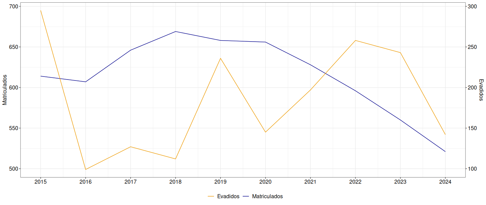{fig-align="center" width=1600}


***

## Cenário atual

<br/>

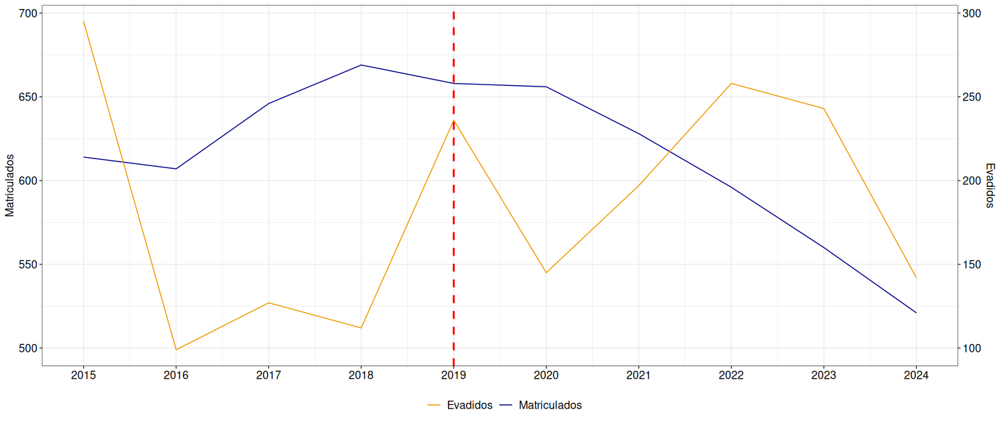{fig-align="center" width=1600}


## Estratégias definidas {background-color="#172a46" .center}
```{css, echo = FALSE}
.center h2 {
  text-align: center !important
}
```

***

### Estratégias definidas

A partir dos objetivos propostos, duas estratégias de trabalho foram definidas:


:::: {.columns}
::: {.column width="60%"}
::: {.fragment .fade-in fragment-index=1}
* **Informações do SIE**: Os dados obtidos nas bases institucionais da Ufes serão organizados, analisados e disponibilizados em um painel digital de
livre acesso.
:::

::: {.fragment .fade-in fragment-index=2}
* **Coleta de dados**: Será construído um instrumento de coleta baseados na 
teoria de resposta ao item, garantindo precisão na avaliação de características individuais e contextuais dos alunos.
:::
:::

::: {.column width="40%"}
:::{.fragment .fade-in fragment-index=1}
<br/>
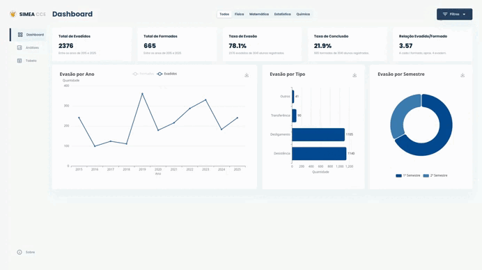{fig-align="center" width=100%}
<p style="text-align: center; font-size: 20px;">
**Fonte**: Painel <a href="https://cheriroga.github.io/projeto_evasao/index.html" target="_blank">SiMEA-CCE</a>.</p>
:::
:::
::::

:::{.fragment .fade-in fragment-index=2}
<span style="color:grey"><font size=5>Os dados coletados serão analisados 
com o uso de modelos estatísticos convencionais e algoritmos de aprendizado de 
máquina, permitindo a identificação de padrões significativos e
a identificação de situações com maior risco de evasão.
</font></span>
:::

***

## Informações do SIE


***

## Coleta de dados

Foi construido um instrumento de coleta para ação individual e para 
monitoramento institucional, i.e., o instrumento de coleta será útil
para prever o risco individual de evasão e identificar os itens que 
aumentam esse risco. 

<br/><br/>

:::: {.columns}
::: {.column width="60%"}
**Público-alvo**: O instrumento será aplicado para ingressantes e 
estudantes até 2 ano de faculdade. Pesquisas apontam que o período 
de 1 ano e meio a 2 anos de faculdade é o mais crítico e apresenta 
a maior incidência de evasão acadêmica.
:::

::: {.column width="40%"}
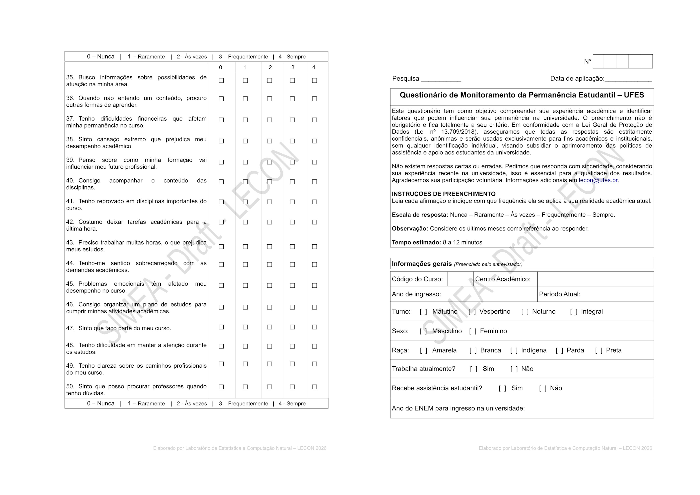{fig-align="center" width=100%}

<p style="text-align: center; font-size: 20px;">
**Fonte**: Questionário <a href="https://" target="_blank">SiMEA-CCE</a>.</p>
:::
::::

***

### Operacionalização das dimensões

::: {.r-stack}
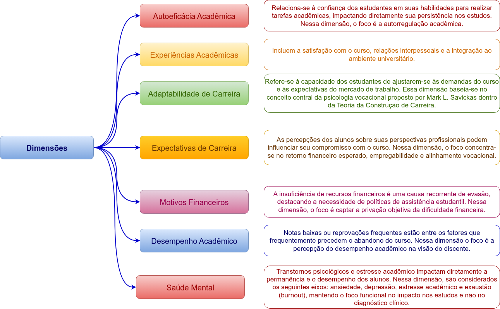{.fragment .fade-out width=100% fig-align="center" fragment-index=1}

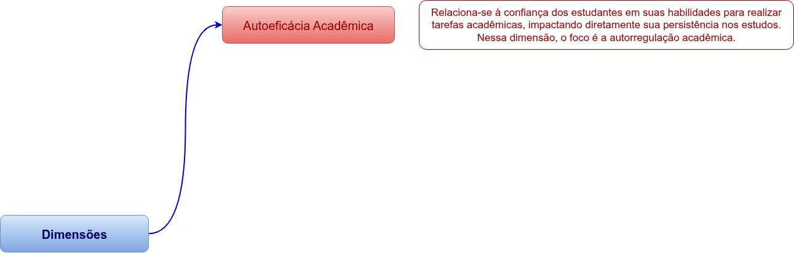{.fragment .fade-in-then-out width=100% fig-align="center" fragment-index=1}

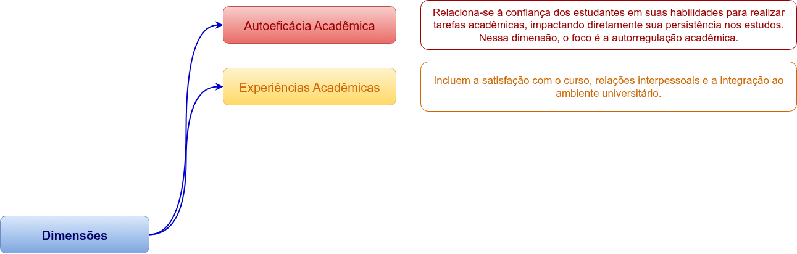{.fragment .fade-in-then-out width=100% fig-align="center" fragment-index=2}

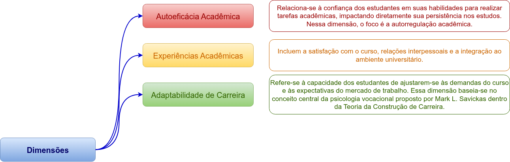{.fragment .fade-in-then-out width=100% fig-align="center" fragment-index=3}

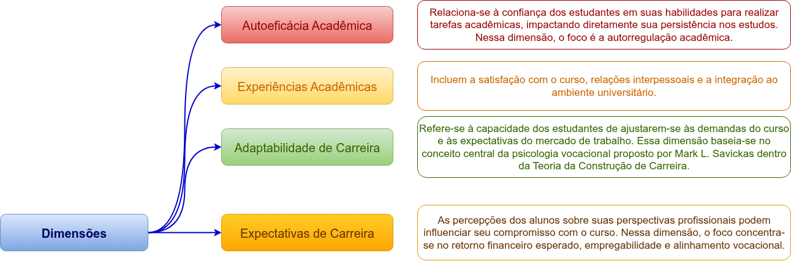{.fragment .fade-in-then-out width=100% fig-align="center" fragment-index=4}

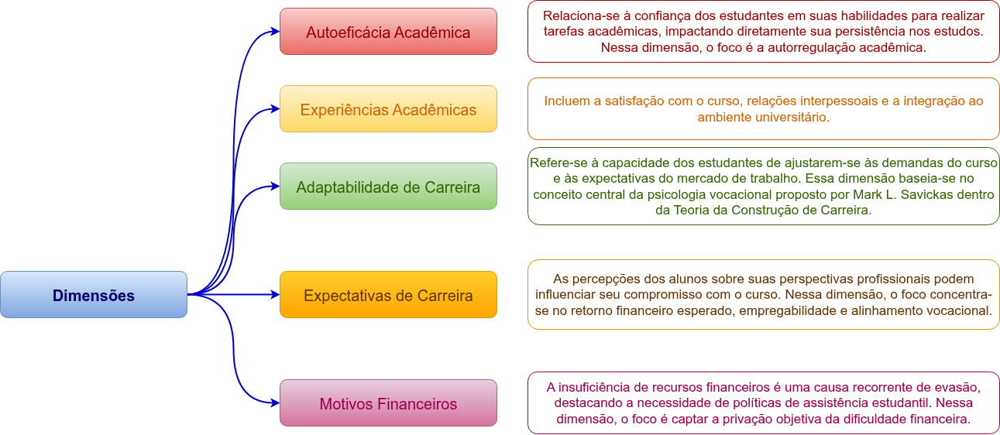{.fragment .fade-in-then-out width=100% fig-align="center" fragment-index=5}

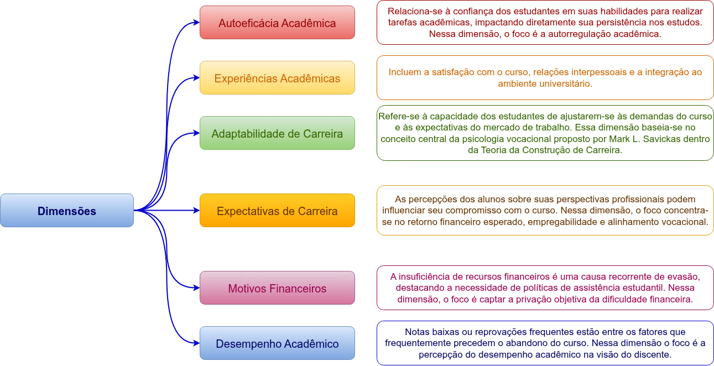{.fragment .fade-in-then-out width=100% fig-align="center" fragment-index=6}

{.fragment .fade-in-then-out width=100% fig-align="center" fragment-index=7}
:::


***

### Matriz de especificações

::: {.r-stack}
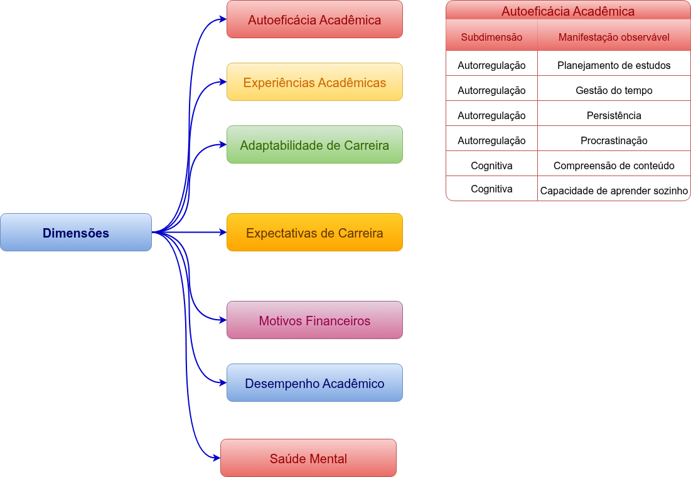{.fragment .fade-out width=100% fig-align="center" fragment-index=1}

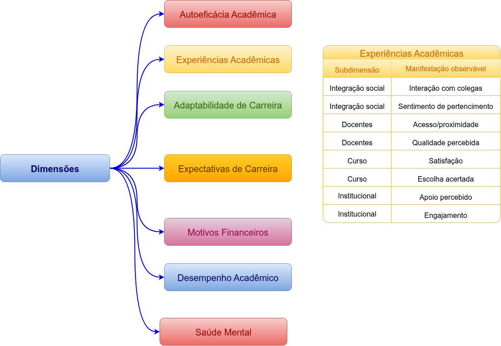{.fragment .fade-in-then-out width=100% fig-align="center" fragment-index=1}

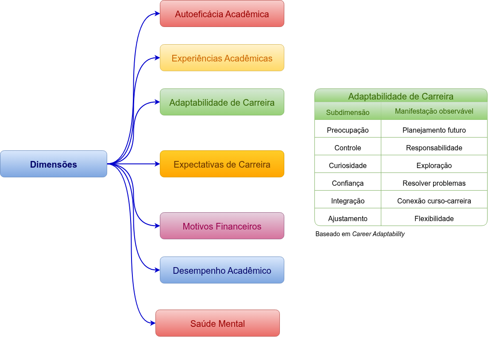{.fragment .fade-in-then-out width=100% fig-align="center" fragment-index=2}

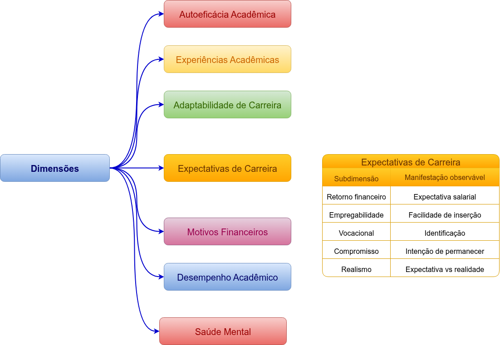{.fragment .fade-in-then-out width=100% fig-align="center" fragment-index=3}

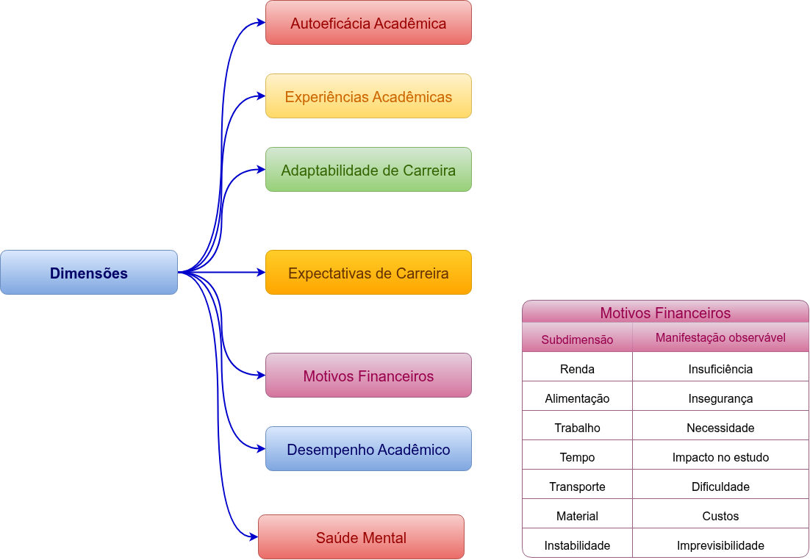{.fragment .fade-in-then-out width=100% fig-align="center" fragment-index=4}

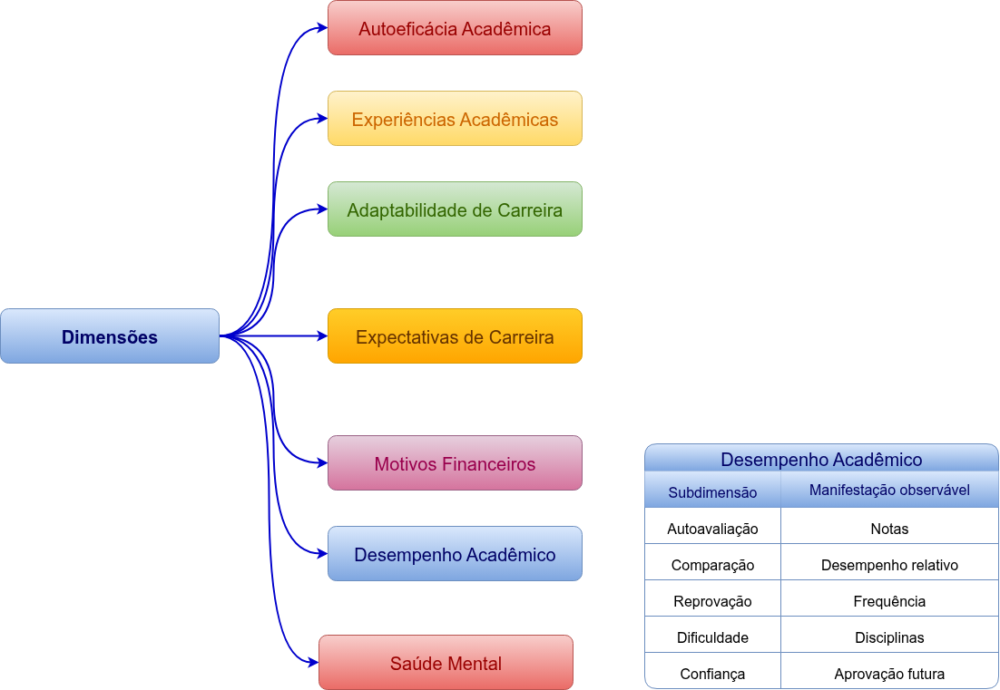{.fragment .fade-in-then-out width=100% fig-align="center" fragment-index=5}

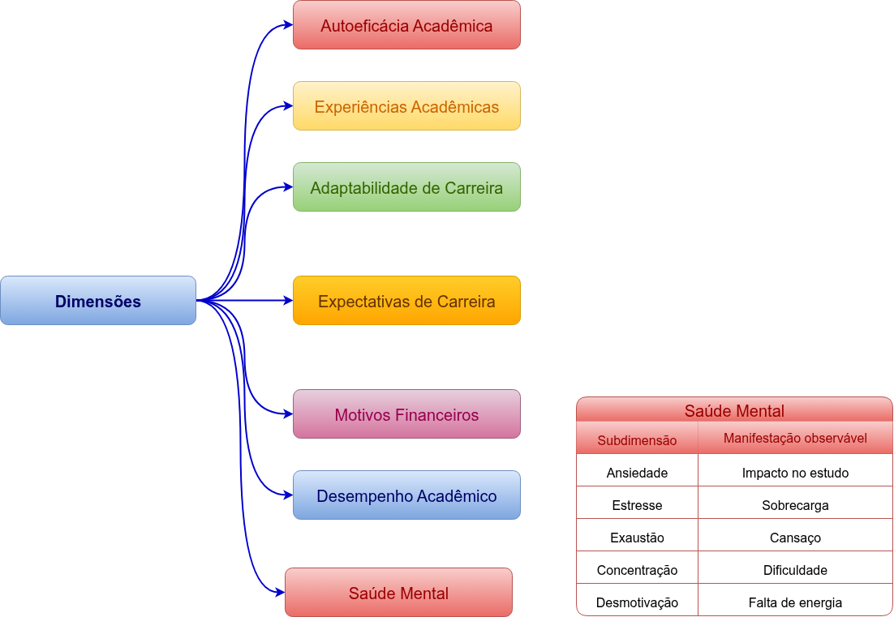{.fragment .fade-in-then-out width=100% fig-align="center" fragment-index=6}

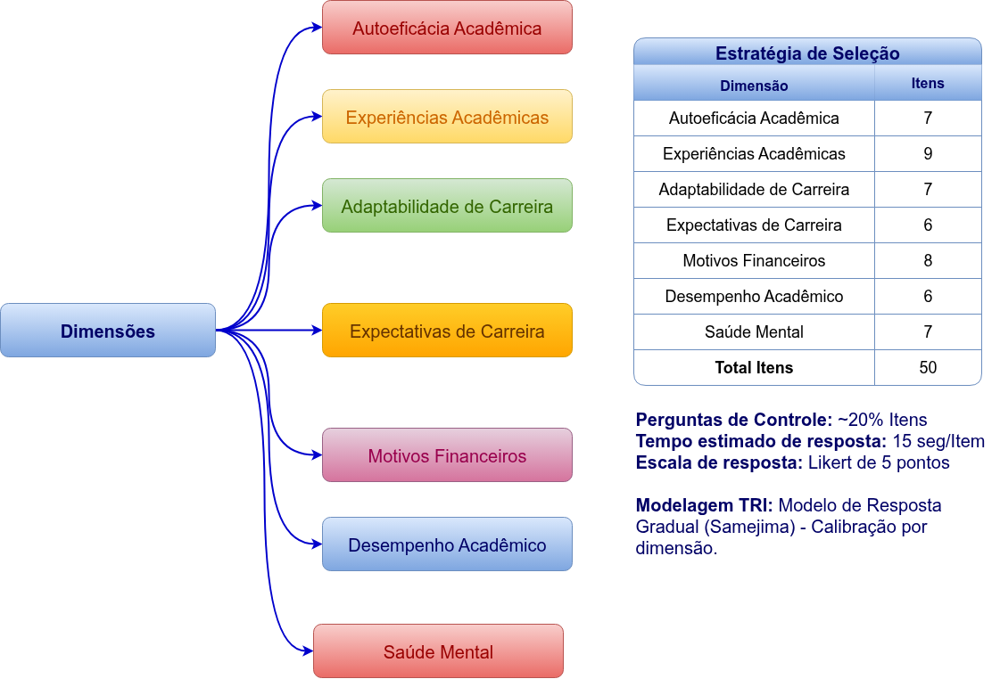{.fragment .fade-in-then-out width=100% fig-align="center" fragment-index=7}
:::

***

<br/><br/><br/><br/><br/>
<p style="text-align: center; font-size: 200px;">
Obrigado!</p>

<!-- ## Referências -->
<!-- ::: {#refs} -->
<!-- ::: -->

## Política de proteção aos direitos autorais

> <span style="color:grey"><font size=6>O conteúdo disponível consiste em material protegido pela legislação brasileira, sendo certo que, por ser
o detentor dos direitos sobre o conteúdo disponível na plataforma, o **LECON** e o **NEAEST** detém direito
exclusivo de usar, fruir e dispor de sua obra, conforme Artigo 5<sup>o</sup>, inciso XXVII, da Constituição Federal
e os Artigos 7<sup>o</sup> e 28<sup>o</sup>, da Lei 9.610/98.
A divulgação e/ou veiculação do conteúdo em sites diferentes à plataforma e sem a devida autorização do
**LECON** e o **NEAEST**, pode configurar violação de direito autoral, nos termos da Lei 9.610/98, inclusive podendo
caracterizar conduta criminosa, conforme Artigo 184<sup>o</sup>, §1<sup>o</sup> a 3<sup>o</sup>, do Código Penal.
É considerada como contrafação a reprodução não autorizada, integral ou parcial, de todo e qualquer
conteúdo disponível na plataforma.</font></span>

{fig-align="center" width=1800}

<span style="color:grey"><font size="4">Material elaborado pela equipe LECON/NEAEST: 
Alessandro J. Q. Sarnaglia, Bartolomeu Zamprogno, Fabio A. Fajardo, Luciana G. de Godoi 
e Nátaly A. Jiménez.</font></span>
